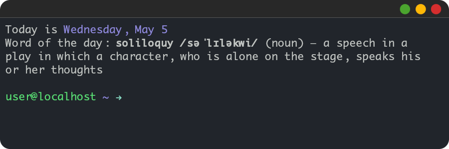

# Solilocli

A command-line client for [Soliloquy](https://github.com/octoman90/soliloquy), a word-of-the-day service for learning unusual, archaic, literary, poetic, formal and rarely used English words.



## Dependency installation

```bash
pip install -r requirements.txt --user
```

## Usage

```bash
python solilocli.py
```

## Flags

| Flag | Description          | Default                      | Notes                      |
| ---- | -------------------- | ---------------------------- | -------------------------- |
| `-n` | Don't use cache      | False                        | May be used for testing    |
| `-d` | Specify date format  | "%A, %B %-d"                 | Use "" to not display date |
| `-e` | Specify endpoint URI | "https://soliloquy.hemlo.cc" |                            |

## Contributing

Pull requests are welcome. For major changes, please open an issue first to discuss what you would like to change.

## License

[MIT](LICENSE)
